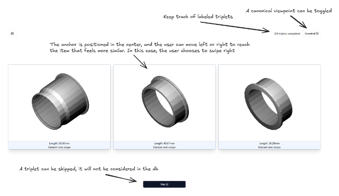
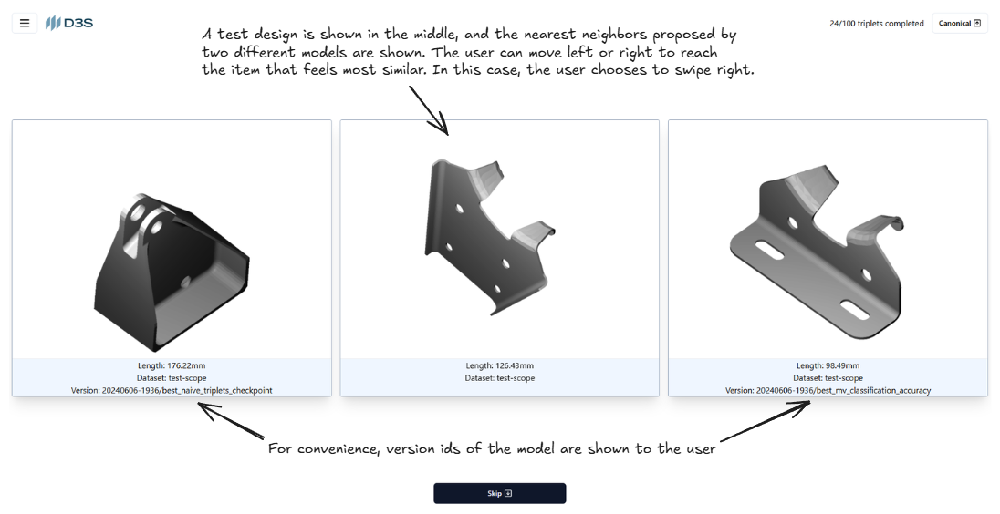

## Introduction

This is the backend for the triplet labelizer app. This application provides an intuitive interface for labeling triplets.
A triplet is a set of three elements, typically used in machine learning and data annotation tasks. An anchor serves as the reference point, a positive element is similar to the anchor, and a negative element is dissimilar to the anchor.

It’s important to note that this app is flexible enough to work with **any type of triplets** — all we need are images of the items we’re using!

In particular, I used triplets for [triplet loss-based](https://en.wikipedia.org/wiki/Triplet_loss) training of a 3D encoder deep learning model for CAD designs.

### Labeling Tab

The main tab is used to retrieve labeled triplets that will be used to train a model.

### Validation Tab

A validation tab has been added to compare the performance across different model iterations. From the user's perspective, the task remains the same: they must choose the design most similar to the one displayed in the center. However, there is no concept of positive or negative in this context. The user provides an assessment of the model's quality.

### Database configuration Tab

This tab is used to easily interact with the db, like inserting new triplets or retrieving the results.

## Development

General development documentation: [development.md](./development.md).
